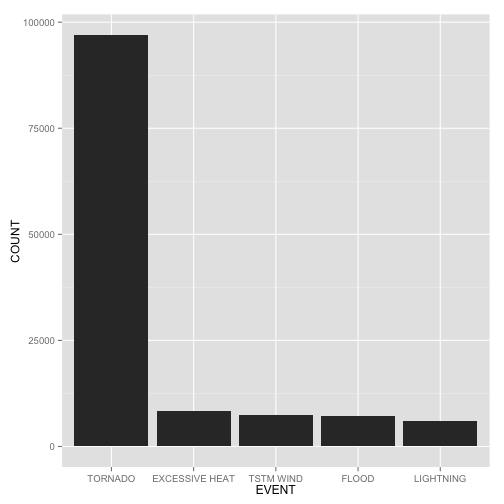
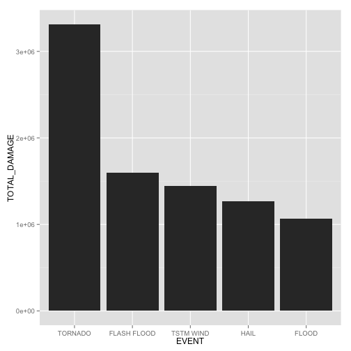

# Severe Weather Events and Their Effects on Population Health and Economic Impact"
## Kyle Scully
### August 23, 2014

## Synopsis

Storms and other severe weather events can cause both public health and economic
problems for communities and municipalities. Many severe events can result in
fatalities, injuries, and property damage, and preventing such outcomes to the
extent possible is a key concern.

This project involves exploring the U.S. National Oceanic and Atmospheric
Administration's (NOAA) storm database. This database tracks characteristics of
major storms and weather events in the United States, including when and where
they occur, as well as estimates of any fatalities, injuries, and property
damage.

This report will show that of all severe weather events, tornadoes are most the
harmful with respect to population health.  Additionally, data suggesting that
tornadoes also have the greatest economic consequences will be reported
here.

## Data Processing
First we download and read in the data so that we can analyze it using the R programming language:


```r
library(R.utils)

if (!file.exists("./repdata-data-StormData.csv")){
  download.file(
		"https://d396qusza40orc.cloudfront.net/repdata%2Fdata%2FStormData.csv.bz2",
		destfile = "./repdata-data-StormData.csv.bz2",
		method = "curl"
  )

	bunzip2("./repdata-data-StormData.csv.bz2")
}

data <- read.csv("repdata-data-StormData.csv")
```

To analyze the total harm to the population health we need add the recorded death count for a given event and the recorded injury count for that particular event and form a new column with the sum:


```r
data[,'TOTAL_HARM'] <- data[,'FATALITIES'] + data[,'INJURIES']
```

Likewise, in order to analyze the total fiscal damage we need to sum the recorded fiscal damage to property and fiscal damage to crops into a new column:


```r
data[,'TOTAL_DMG'] <- data[,'PROPDMG'] + data[,'CROPDMG']
```

Lets first address harm to population health.  We create a new list which sums all the harm counts by the event type:


```r
harm_count <- aggregate(data$TOTAL_HARM, by = list(data$EVTYPE), sum)
```

Lets reorder the list by the highest count and show the top 10 events:


```r
harm_count <- harm_count[with(harm_count, order(-x)), ]

row.names(harm_count) <- NULL
colnames(harm_count) <- c("EVENT","COUNT")

harm_count$EVENT <- as.character(harm_count$EVENT)
harm_count$EVENT <- factor(harm_count$EVENT, levels=unique(harm_count$EVENT))

head(harm_count,10)
```

```
##                EVENT COUNT
## 1            TORNADO 96979
## 2     EXCESSIVE HEAT  8428
## 3          TSTM WIND  7461
## 4              FLOOD  7259
## 5          LIGHTNING  6046
## 6               HEAT  3037
## 7        FLASH FLOOD  2755
## 8          ICE STORM  2064
## 9  THUNDERSTORM WIND  1621
## 10      WINTER STORM  1527
```

Now lets do the same for economic impact of the events.  First we create a list which sums all the fiscal damage by the event type:


```r
fiscal_impact <- aggregate(data$TOTAL_DMG, by = list(data$EVTYPE), sum)
```

Lets reorder the list by the highest damage in dollars and show the top 10 events:


```r
fiscal_impact <- fiscal_impact[with(fiscal_impact, order(-x)), ]

row.names(fiscal_impact) <- NULL
colnames(fiscal_impact) <- c("EVENT","TOTAL_DAMAGE")

fiscal_impact$EVENT <- as.character(fiscal_impact$EVENT)
fiscal_impact$EVENT <- factor(fiscal_impact$EVENT, levels=unique(fiscal_impact$EVENT))

head(fiscal_impact,10)
```

```
##                 EVENT TOTAL_DAMAGE
## 1             TORNADO      3312277
## 2         FLASH FLOOD      1599325
## 3           TSTM WIND      1445168
## 4                HAIL      1268290
## 5               FLOOD      1067976
## 6   THUNDERSTORM WIND       943636
## 7           LIGHTNING       606932
## 8  THUNDERSTORM WINDS       464978
## 9           HIGH WIND       342015
## 10       WINTER STORM       134700
```

## Results

#### Across the United States, which types of events are most harmful with respect to population health?


```r
library(ggplot2)
ggplot(data=harm_count[1:5,], aes(x=EVENT, y=COUNT)) + geom_bar(stat="identity")
```

 

From the plot above we can see that the events which are most harmful with respec to population health are tornadoes.

#### Across the United States, which types of events have the greatest economic consequences?

```r
library(ggplot2)
ggplot(data=fiscal_impact[1:5,], aes(x=EVENT, y=TOTAL_DAMAGE)) + geom_bar(stat="identity")
```

 

From the plot above we can see that the events which have the greatest economic consequences are also tornadoes.
